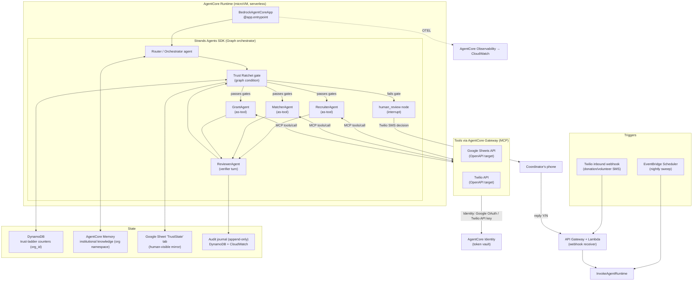

# Steward — Implementation Plan & Architecture (Single Source of Truth)

> **Project codename:** Steward (with the *Trust Ratchet*)
> **Hackathon:** AWS **Agents for Humans** · Track: **Good Neighbor** · Grand-Prize target.
> **Status of this doc:** Authoritative. Every fact below was researched and source-linked on **2026-09-03**. Any agent working on this project should treat this file as the single source of truth and **not guess** — if something is missing, add it here and cite a source.
> **How to use this doc (for AI agents & humans):** Read §0–§4 for *what* and *why*; §5–§9 for *how to build*; §10–§14 for *plan, cost, deliverables*; §15 for *every primary source*. Section §16 lists open decisions — resolve them here, don't improvise.

---

## §0. How this document is organized

| § | Section | Read when you need… |
|---|---|---|
| 1 | Executive summary & the idea | The one-paragraph pitch and the novelty claim |
| 2 | Hackathon requirements & eligibility | To confirm we stay eligible and score |
| 3 | The Trust Ratchet — full spec | The core mechanic (state machine, rules) |
| 4 | Product scope (features, MVP vs. stretch) | To know what to build and what to cut |
| 5 | System architecture | The component diagram + data flow |
| 6 | Data model | Exact schemas (Sheets tabs, DynamoDB, Memory) |
| 7 | Tech stack — exact packages & versions | To install and pin dependencies |
| 8 | Component-by-component build spec | To implement each agent/tool/gate |
| 9 | Repository structure | Where every file goes |
| 10 | 6-week build plan & milestones | The schedule |
| 11 | Demo video script + proof numbers | The primary scored artifact |
| 12 | Cost budget vs. the $50 credit | To not blow the budget |
| 13 | Risks & mitigations | Known traps |
| 14 | Deliverables checklist | Submission gate |
| 15 | References (docs + papers, verified) | Primary sources to read |
| 16 | Open decisions & assumptions | Things to lock before coding |

---

## §1. Executive summary & the idea

### 1.1 One-paragraph pitch
**Steward** is a background AI agent for tiny, budget-less, IT-less community organizations — a 3-person food pantry, a PTA, a mutual-aid group — that run everything on a **group chat + a Google Sheet**. Steward lives *inside those exact tools* (SMS/WhatsApp + one Google Sheet, **zero migration, zero config**) and autonomously handles the repetitive coordination work: matching perishable/in-kind donations to local need before they spoil, confirming volunteers via a 3-touch SMS sequence and auto-backfilling dropped shifts, tracking grant deadlines and drafting reports, and preserving institutional memory across volunteer turnover. It runs in the **background** and **surfaces to a human only when there is a genuine decision to make**.

### 1.2 The novel mechanic that makes it unique — the *Trust Ratchet*
The distinctive, un-built idea: **Steward earns its autonomy per task-type.** It starts in *approve-everything* mode and graduates a task-type to automatic **only after it proves reliability** (verified-correct actions), and **demotes** it on error. Anything touching **money or members' private data never goes fully automatic** — hard ceiling. The earned-trust state is **institutional** (stored at the *organization* level), so **it survives volunteer/coordinator turnover** — a new coordinator inherits an agent that has already proven itself. No existing product does earned, graduated autonomy that persists across staff churn.

### 1.3 Why this wins (maps to the 5 judging criteria)
- **Technical Implementation:** named Strands multi-agent pattern (**Graph** + **Agents-as-Tools**) + externalized verifier + deployed on AgentCore (**Gateway + Memory + interrupts** used together — a hard-to-fake depth signal).
- **Design:** a complete product on a substrate real orgs already use; the trust ladder + audit trail are visible.
- **Potential Impact:** civic story, a real identifiable user, one quantified proof number.
- **Creativity & Originality:** the Trust Ratchet is a single legible mechanism nobody has shipped.
- **Presentation:** the demo shows the ratchet *moving* and ends on the escalation "buzz." (§11)

### 1.4 Provenance
This plan supersedes "Idea 4" in `agents-for-humans-idea-research.md`. It fuses **Idea 1 (Steward)** and **Idea 3 (Ratchet)** from that brief. Read that file for the competitive landscape and the research spine; read *this* file to build.

---

## §2. Hackathon requirements & eligibility (authoritative)

> Source: official rules `https://agentsforhumans.devpost.com/rules`, overview `https://agentsforhumans.devpost.com/`, resources `https://agentsforhumans.devpost.com/resources`. Fetched 2026-09-03.

### 2.1 Hard dates (do not miss)
| Milestone | Date/time |
|---|---|
| Submission window opens | Aug 10, 2026, 9:00 AM PT |
| **⚠️ AWS credits request deadline** | **Sept 11, 2026, 12:00 PM PT** (3 days before submission) |
| **⛔ Submission deadline (hard)** | **Sept 14, 2026, 5:00 PM PT** (= 8:00 PM EDT) |
| Judging | Sept 15 – Oct 8, 2026 |
| Winners announced | Oct 14, 2026 (~2:00 PM PT) |

### 2.2 Prizes
- **Total pool $40,000 USD.** Grand Prize **$10,000** + AWS social feature + meeting with AWS technical experts.
- Each of the **3 tracks**: Gold **$5,000** / Silver **$3,000** / Bronze **$2,000**.
- **A project can win only one (1) prize.**

### 2.3 Tracks — we target **Good Neighbor**
- Everyday Agents — "takes the busywork out of daily life."
- Professional Agents — "makes someone dramatically better at the work they already do."
- **Good Neighbor Agents — "an agent that helps groups of people, not just one." ← Steward fits here exactly.**

### 2.4 Mandatory vs. recommended tech
- **MANDATORY:** Build a **new** AI agent with the **Strands Agents SDK** (Python or TypeScript). Judging explicitly evaluates "thoroughness using Strands Agents." **We use Python.**
- **RECOMMENDED (not required, boosts Technical score):** **Amazon Bedrock AgentCore** for deployment. **We will use it** (Runtime + Gateway + Memory + Identity + Observability) — that is our depth edge.
- **REQUIRED in the submission:** an **AWS Builder ID**.

### 2.5 Judging criteria (5, **equally weighted**) + bonus
1. Technological / Technical Implementation (thoroughness with Strands)
2. Design (complete product experience)
3. Potential Impact (real problem, real audience)
4. Creativity & Originality (non-obvious)
5. Presentation (clear video demo + pitch)
- **Bonus: up to +0.6 pts** — **0.2 per builder.aws.com blog post** covering the build journey, **"Agents for Humans" in the title**, publicly published before the deadline, **max 3 posts**. → **Plan: write 3 posts.**

### 2.6 Required deliverables (hard gates)
- [ ] **Public repo** (GitHub/GitLab/Bitbucket) containing source + setup instructions **and an MIT or Apache LICENSE file** (hard eligibility gate).
- [ ] **README** + **architecture diagram** (both required, in repo).
- [ ] **Demo video ≤ 5 minutes** showing a working demo + pitch covering **(1) the problem (2) who it's for (3) why it matters**. Host publicly (YouTube/Vimeo).
- [ ] **AWS Builder ID** in the submission form.
- [ ] Devpost text description of features/functionality.
- [ ] *Optional but strengthens score:* a **live demo link** (deployed app).
- [ ] *Bonus:* up to 3 builder.aws.com posts.

### 2.7 Eligibility constraints
- Must be **newly created during the submission window**; disclose any pre-existing code incorporated. **⇒ Start the repo fresh; commit history should live inside the window.**
- Age of majority in your jurisdiction. Solo or team allowed; multiple (unique) submissions allowed but one prize per project.
- **⛔ Excluded jurisdictions (residents cannot participate):** Argentina, Australia, Brazil, Hong Kong, Indonesia, Italy, Malaysia, Philippines, Thailand, Vietnam, **Singapore**, Belarus, DNR, LNR, **UAE**, **Quebec (Canada)**, Russia, Crimea, Cuba, Iran, North Korea, Syria. **India is NOT excluded.** → **Verify every teammate's residency against this list before submitting.**
- Repo license **must be MIT or Apache** (see 2.6).

### 2.8 Claim the credits
- **$50 AWS promotional credits** per participant, "while supplies last." Request form: `https://forms.gle/Ssr8zLw4afKg114M7` — **submit before Sept 11, 12:00 PM PT.**
- New AWS customers may also get **up to $200 Free Tier credits**.

---

## §3. The Trust Ratchet — full specification (the core mechanic)

This is the centerpiece. Implement it exactly as specified so it is *provable* and *visible* on screen.

### 3.1 Autonomy levels (per task-type)
| Level | Name | Behavior |
|---|---|---|
| **L0** | **ASSISTED** | Agent proposes the action; **a human must approve** before it executes (Strands interrupt → coordinator SMS). |
| **L1** | **SUPERVISED** | Agent **auto-executes but notifies** the coordinator and provides an **undo window** (default 15 min). No pre-approval. |
| **L2** | **AUTONOMOUS** | Agent executes **silently**; logged to the audit journal only. |

### 3.2 Per-task-type ceilings (hard caps — never exceed)
| Task-type (`task_type` key) | Description | **Max level (cap)** | Rationale |
|---|---|---|---|
| `volunteer_reminder` | 3-touch shift-confirmation SMS | **L2** | Low cost of error |
| `shift_backfill` | Text next-eligible volunteer when one drops | **L2** | Low cost of error |
| `grant_deadline_alert` | Notify coordinator of an upcoming deadline | **L2** | Informational |
| `donation_match` | Match incoming donation → a local need | **L1** | Perishable, real-world stakes; keep a human in the loop |
| `grant_report_draft` | Draft a post-award report | **L1** | Content review advisable |
| `grant_report_file` | **Submit/file** a report to a funder | **L0 (hard)** | Irreversible, funder relationship |
| `money_movement` | Anything moving/committing money | **L0 (hard)** | Irreversible — **out of MVP scope** |
| `pii_disclosure` | Reveal a member's private info to a third party | **L0 (hard)** | Consent/selective-disclosure required |

> **Rule:** `effective_level = min(current_earned_level, task_cap)`. A capped-L0 task *always* asks, no matter how much trust is earned.

### 3.3 Graduation (promotion) rule
- Each task-type has a counter `consecutive_verified_correct`.
- An action counts as **verified-correct** when **both**: (a) the **ReviewerAgent** (independent verifier turn, §8.4) scores it correct, **and** (b) at L0, the human **approved** it (or at L1, the undo window expired **without** a human undo).
- When `consecutive_verified_correct >= PROMOTION_THRESHOLD` (default **5**) **and** `effective_level < task_cap`: **promote one level**, reset the counter, write an audit entry, and notify the coordinator ("Steward has earned Supervised autonomy for volunteer reminders").
- Promotion is **one level at a time** (the "ratchet clicks forward once").

### 3.4 Demotion rule (the ratchet can slip back on failure)
- On a **verified error** (ReviewerAgent flags incorrect) **or** a **human override/undo/rejection**: **demote one level** and reset `consecutive_verified_correct = 0`. Write an audit entry with the reason.
- Demotion never goes below L0.

### 3.5 Escalation decision (when to surface to a human)
Two independent gates; **both** must pass for autonomous execution, else escalate/propose:
1. **Autonomy gate:** `effective_level` for the task-type must be ≥ the level required to act without pre-approval (L1 or L2).
2. **Confidence gate (Value-of-Information / cost-ratio):** execute only if `confidence ≥ 1 − (cost_of_asking / cost_of_error)`; otherwise escalate. Per *Act or Escalate?* (2026) and the VOI framework (2026) — **thresholds are model-specific; measure your model's real behavior, don't assume.** (See §15 refs 2, 8.)
- If either gate fails → route to the **`human_review`** node → Strands interrupt → coordinator SMS with a crisp decision.

### 3.6 Institutional persistence (the unique twist)
- Trust-ladder state is keyed by **`org_id` (NOT `user_id`)**. It lives in **DynamoDB** (structured, atomic counters) and is **mirrored** to a read-only `TrustState` tab in the org's Google Sheet for human visibility.
- Institutional *knowledge* (org context, preferences, past episodes) lives in **AgentCore Memory** at the org namespace.
- **Result:** when a coordinator leaves and a new one joins, both the earned autonomy **and** the org knowledge persist. Directly answers CHI 2025's "control centralizes in the login-holder" critique (§15 ref 9).

### 3.7 Tunable parameters (single place to change)
```yaml
# config/ratchet.yaml
promotion_threshold: 5          # consecutive verified-correct actions to promote
undo_window_seconds: 900        # L1 supervised undo window (15 min)
default_start_level: 0          # everything starts ASSISTED
confidence_floor_global: 0.55   # never auto-act below this regardless of cost ratio
task_caps:                      # see §3.2
  volunteer_reminder: 2
  shift_backfill: 2
  grant_deadline_alert: 2
  donation_match: 1
  grant_report_draft: 1
  grant_report_file: 0
  money_movement: 0
  pii_disclosure: 0
cost_ratios:                    # cost_of_asking / cost_of_error, per task-type (0..1)
  volunteer_reminder: 0.30
  shift_backfill: 0.25
  donation_match: 0.10
  grant_report_draft: 0.15
  grant_report_file: 0.02
```

---

## §4. Product scope

### 4.1 MVP (must ship — this is what the demo shows)
1. **Volunteer reminder + backfill** (`volunteer_reminder`, `shift_backfill`) — the fast-graduating tasks, so the ratchet visibly moves L0→L1→L2 during the demo.
2. **Donation → need matching** (`donation_match`) — capped at L1 (supervised), the perishable-milk escalation moment.
3. **Grant deadline alert + report draft + file** (`grant_deadline_alert`, `grant_report_draft`, `grant_report_file`) — shows a task **permanently gated at L0** (never auto), contrasting with the graduated tasks.
4. **The Trust Ratchet** governing all of the above (promotion/demotion/ceilings, DynamoDB + Sheet mirror).
5. **ReviewerAgent** externalized verification feeding graduation.
6. **Escalation surface** — Strands interrupt → Twilio SMS to coordinator; resumable.
7. **Audit journal** — append-only, every action + confidence + reasoning + sources.
8. **Two triggers:** nightly EventBridge sweep + inbound donation SMS webhook.

### 4.2 Stretch (only after MVP is solid)
- Institutional-memory Q&A ("what did we do last winter?") via AgentCore Memory retrieval.
- Selective-disclosure protocol for `pii_disclosure` (CalBench-inspired, §15 ref 6).
- WhatsApp channel in addition to SMS.
- A tiny read-only web dashboard (live demo link → scoring boost) showing the trust ladder.

### 4.3 Explicitly OUT of scope (do not build)
- Any real money movement / payments.
- A custom database migration or a replacement for the org's Sheet.
- Real government/insurer portals (that was Idea 2 "Kin"; not this project).
- Multi-org tenancy beyond a single `org_id` (design for it, don't build it).

---

## §5. System architecture

### 5.1 Component diagram


### 5.2 Data flow — the two triggers
**A) Nightly sweep (EventBridge Scheduler → InvokeAgentRuntime):**
1. Scheduler fires → `InvokeAgentRuntime` with `{"mode":"sweep","org_id":...}`.
2. Entrypoint reads the org's Sheet (shifts needing confirmation, grant deadlines, unplaced donations).
3. For each task, Router picks the specialist agent; **Trust Ratchet gate** computes `effective_level` + confidence.
4. If gates pass → specialist executes via Gateway tools (send SMS / update Sheet / draft report); **ReviewerAgent** verifies; ratchet updates counters.
5. If a gate fails → `human_review` interrupt → coordinator SMS.
6. Because sweeps can run long, use the **async task pattern** (§8.7) so the entrypoint returns fast and `/ping` reports `HealthyBusy`.

**B) Inbound event (donation SMS arrives):**
1. Twilio posts the inbound SMS to API Gateway → Lambda → `InvokeAgentRuntime` with `{"mode":"event","payload":...}` and a stable `runtimeSessionId` for that org.
2. MatcherAgent matches donation → need (capped L1: auto-match but notify + undo window).
3. If it can't place a perishable item in time / confidence below threshold → escalate to coordinator.

### 5.3 The Trust Ratchet as a Strands Graph condition
The ratchet gate is implemented as a **conditional edge** in the Strands Graph (§8.3): the condition function reads `effective_level` + `confidence` from state and routes either to the specialist-execution node or to `human_review`. This makes "surface only for real decisions" a *deterministic, auditable* graph property, not prompt-dependent behavior.

---

## §6. Data model (exact schemas)

### 6.1 Google Sheet (the org's substrate) — one spreadsheet, these tabs
> Zero-migration: this is a normal Google Sheet the org already keeps. We standardize column headers.

**`Volunteers`** — `volunteer_id | name | phone_e164 | skills | availability | last_contacted | reliability_note`
**`Shifts`** — `shift_id | date | start | end | role | needed_count | assigned_ids | status(open/filled/at_risk) | notes`
**`Donations`** — `donation_id | received_at | item | qty | unit | perishable(bool) | expiry | donor | status(new/matched/placed/expired) | matched_need_id`
**`Needs`** — `need_id | item | qty_needed | location | priority | window_end | status(open/met)`
**`Grants`** — `grant_id | funder | amount | award_date | report_due | status(active/reported) | report_url`
**`TrustState`** *(read-only mirror written by Steward; for human visibility + demo)* — `task_type | current_level | consecutive_verified_correct | cap | last_changed | last_reason`
**`AuditLog`** *(optional human-visible mirror of the audit journal)* — `ts | task_type | action | level | confidence | outcome | reviewer_verdict | escalated(bool) | notes`

### 6.2 DynamoDB — authoritative trust state & audit journal
**Table `steward_trust`** (PK `org_id`, SK `task_type`):
```
org_id (S, PK) | task_type (S, SK) | current_level (N) | consecutive_verified_correct (N)
| cap (N) | updated_at (S) | last_reason (S)
```
Use **atomic conditional updates** to increment/reset counters (avoids races between the sweep and inbound events).

**Table `steward_audit`** (PK `org_id`, SK `ts#uuid`) — append-only:
```
org_id (S, PK) | sk (S, SK = ISO8601#uuid) | task_type | action | level | confidence (N)
| reviewer_verdict | outcome | escalated (BOOL) | reasoning (S) | sources (SS)
```
> Rationale for DynamoDB over AgentCore Memory for counters: Memory is semantic/retrieval (RetrieveMemoryRecords, cosine similarity) and not designed for atomic numeric counters. See §15 AgentCore Memory. Keep counters in DynamoDB; keep *knowledge* in Memory.

### 6.3 AgentCore Memory — institutional knowledge (org namespace)
- One **Memory** resource for the project. Long-term strategies to enable (§8.6):
  - `semanticMemoryStrategy` — org facts (e.g., "the Tuesday driver covers the north side").
  - `userPreferenceMemoryStrategy` — coordinator/org preferences (contact hours, tone).
  - `summaryMemoryStrategy` — per-session summaries of what Steward did.
- **Namespace:** organize by `org_id` (the actor), e.g. `/orgs/{org_id}/...`, **not** by individual user — this is what makes knowledge survive turnover.

---

## §7. Tech stack — exact packages & versions

> All versions verified live on PyPI on 2026-09-03. **Pin these in `requirements.txt`.** Re-check `agentcore --help` and Bedrock model IDs in-account before the final build (they move fast).

### 7.1 Core Python packages
| Package | Version (verified) | Purpose |
|---|---|---|
| `strands-agents` | **1.54.0** (GA, Production/Stable) | The mandatory agent SDK (Agent, Graph, interrupts) |
| `strands-agents-tools` | **0.8.7** | Prebuilt tools (`http_request`, `journal`, `mcp_client`, `agent_core_memory`, `use_aws`, etc.) |
| `bedrock-agentcore` | **1.22.0** | Runtime SDK (`BedrockAgentCoreApp`, `@app.entrypoint`), `MemoryClient` |
| `bedrock-agentcore-starter-toolkit` | **0.3.12** | Legacy Python CLI (see 7.3 caveat) |
| `boto3` | latest | AWS APIs (DynamoDB, `bedrock-agentcore` invoke, EventBridge) |
| `playwright` | latest | Only if using the Browser tool (stretch) |

- **Python 3.10+** (3.12+ if using Nova Sonic voice; not needed for MVP).
- Install:
```bash
pip install strands-agents strands-agents-tools bedrock-agentcore boto3
# CLI (see caveat 7.3 about which CLI is current):
pip install bedrock-agentcore-starter-toolkit    # legacy Python CLI
# OR the current CLI:  npm install -g @aws/agentcore   (Node 20+)
```

### 7.2 Models (Amazon Bedrock) — tiered to control cost
| Role | Model (confirm exact ID in-account) | Why |
|---|---|---|
| Hard reasoning (grant drafting, ambiguous matching) | `global.anthropic.claude-sonnet-4-6` (Strands default) | Quality where it matters |
| Routing + ReviewerAgent + simple steps | a cheap model — **Amazon Nova** (e.g. `us.amazon.nova-lite-v1:0`) or Claude Haiku | 90% of calls, cheap |
- **You must enable model access** for the chosen models in the Bedrock console, and have IAM permission to invoke. Confirm the exact inference-profile IDs available in your region.
- Set the model explicitly per agent:
```python
from strands import Agent
from strands.models import BedrockModel
hard = BedrockModel(model_id="global.anthropic.claude-sonnet-4-6", region_name="us-west-2", temperature=0.3)
cheap = BedrockModel(model_id="us.amazon.nova-lite-v1:0", region_name="us-west-2", temperature=0.0)
```

### 7.3 AgentCore CLI caveat (important — don't waste time here)
- The **`bedrock-agentcore` runtime SDK** (`BedrockAgentCoreApp`, `@app.entrypoint`) is **current** — use it.
- The **Python starter-toolkit CLI** (`agentcore configure` / `agentcore launch`) is **deprecated**; the toolkit now points to the **current CLI = npm `@aws/agentcore`** (`agentcore create / dev / deploy / invoke / status / logs / traces`, Node 20+). **Target the npm CLI for deploy**; if you use the Python toolkit, verify verbs against the installed `0.3.x` (`deploy` vs `launch`).
- Default deploy region in tooling is `us-west-2`; use CodeBuild (no local Docker needed).

### 7.4 External services / accounts
- **AWS account** + **AWS Builder ID** (required for submission).
- **Twilio** account + a phone number (SMS; WhatsApp sandbox optional). API key.
- **Google Cloud** project with the **Sheets API** enabled + OAuth client (for AgentCore Identity's built-in Google OAuth provider). One test Google Sheet as the demo org's substrate.

---

## §8. Component-by-component build spec

### 8.1 Runtime entrypoint (`app/main.py`)
```python
from bedrock_agentcore.runtime import BedrockAgentCoreApp
from app.graph import build_steward_graph

app = BedrockAgentCoreApp()
graph = build_steward_graph()   # Strands Graph (built once)

@app.entrypoint
def invoke(payload):
    mode = payload.get("mode", "event")     # "sweep" | "event"
    org_id = payload["org_id"]
    task_input = payload.get("payload", {})
    result = graph({"mode": mode, "org_id": org_id, "input": task_input})
    # Handle Strands interrupts (escalation) — see §8.5
    if getattr(result, "stop_reason", None) == "interrupt":
        return {"status": "escalated", "interrupts": [i.name for i in result.interrupts]}
    return {"status": "ok", "result": str(getattr(result, "message", result))}

if __name__ == "__main__":
    app.run()   # serves POST /invocations, GET /ping on :8080
```
Local test:
```bash
python app/main.py
curl -X POST http://localhost:8080/invocations -H "Content-Type: application/json" \
  -d '{"mode":"event","org_id":"demo","payload":{"sms":"We have 40 lbs of milk to donate"}}'
```

### 8.2 Specialist agents (Agents-as-Tools) (`app/agents/`)
Each specialist is a Strands `Agent` with a focused system prompt and the Gateway MCP tools it needs. Wrap them as tools of the orchestrator (verified pattern):
```python
from strands import Agent, tool

RECRUITER_PROMPT = """You are Steward's volunteer recruiter... 3-touch SMS sequence..."""

@tool
def recruiter_agent(query: str) -> str:
    """Confirm/backfill volunteer shifts via SMS. Input: a shift + roster context."""
    a = Agent(system_prompt=RECRUITER_PROMPT, tools=[sheets_tool, twilio_tool], model=cheap)
    return str(a(query))

# Similarly: matcher_agent (donation->need), grant_agent (deadline/draft/file).
orchestrator = Agent(system_prompt=ROUTER_PROMPT,
                     tools=[recruiter_agent, matcher_agent, grant_agent], model=cheap)
```

### 8.3 The Graph + Trust Ratchet gate (`app/graph.py`)
```python
from strands import Agent
from strands.multiagent import GraphBuilder
from app.ratchet import effective_level, gate_passes, record_outcome

def ratchet_condition(state):
    """Conditional edge: route to execution only if autonomy + confidence gates pass."""
    task = state.results.get("router")     # task_type + confidence from router node
    return gate_passes(state["org_id"], task.task_type, task.confidence)  # §3.5

def build_steward_graph():
    b = GraphBuilder()
    b.add_node(router_agent, "router")
    b.add_node(execute_node, "execute")        # calls the right specialist as-tool
    b.add_node(reviewer_agent, "review")       # §8.4 externalized verifier
    b.add_node(human_review_node, "human_review")
    b.set_entry_point("router")
    b.add_edge("router", "execute", condition=ratchet_condition)          # gate passes
    b.add_edge("router", "human_review", condition=lambda s: not ratchet_condition(s))
    b.add_edge("execute", "review")            # verify every action
    return b.build()
```

### 8.4 ReviewerAgent — externalized verification (`app/agents/reviewer.py`)
- A **separate agent turn** (not self-check) that receives the action + its inputs and returns a structured verdict `{correct: bool, confidence: float, reason: str}`.
- Rationale: self-correction is an *addressability artifact* — models miss their own errors but catch external ones (Self-Correction Illusion, §15 ref 4). Routing the draft to a distinct reviewer role is a near-free reliability lever.
- Its verdict is what feeds `record_outcome()` (promotion/demotion, §3.3–3.4).

### 8.5 Escalation via Strands interrupts (`app/nodes/human_review.py`)
Use the verified Strands interrupt API:
```python
from strands import tool
from strands.types.tools import ToolContext

@tool(context=True)
def request_decision(tool_context: ToolContext, summary: str, options: list[str]) -> str:
    """Escalate a real decision to the coordinator; pauses until they reply."""
    return tool_context.interrupt("coordinator-decision", reason={"summary": summary, "options": options})
```
- On invocation, the agent returns `result.stop_reason == "interrupt"` with `result.interrupts` (each has `.id`, `.name`, `.reason`).
- The entrypoint sends the `reason.summary` to the coordinator via **Twilio SMS**; the coordinator's reply (via the inbound webhook) is fed back as an `interruptResponse` block to **resume** the same session:
```python
responses = [{"interruptResponse": {"interruptId": iid, "response": reply_text}}]
result = graph(responses)   # resumes from the interruption point
```
- Session continuity relies on a stable `runtimeSessionId` per org (33–256 chars) so the resume lands on the same microVM/session (Runtime resumable sessions).

### 8.6 AgentCore Memory setup (`app/memory.py`)
```python
from bedrock_agentcore.memory import MemoryClient   # note: docs mark MemoryClient "Legacy";
                                                     # MemorySessionManager is recommended for new code — confirm API.
client = MemoryClient(region_name="us-west-2")
memory = client.create_memory_and_wait(
    name="StewardOrgMemory",
    strategies=[
        {"semanticMemoryStrategy":   {"name": "OrgFacts",        "namespaceTemplates": ["/orgs/{actorId}/facts/"]}},
        {"userPreferenceMemoryStrategy": {"name": "OrgPrefs",    "namespaceTemplates": ["/orgs/{actorId}/prefs/"]}},
        {"summaryMemoryStrategy":    {"name": "SessionSummary",  "namespaceTemplates": ["/orgs/{actorId}/summaries/{sessionId}/"]}},
    ],
)
# write: client.create_event(memory_id, actor_id=org_id, session_id=..., messages=[(text, "USER"), ...])
# read : client.retrieve_memories(memory_id, namespace="/orgs/<org_id>/facts/", query="who covers north side")
```
- `actor_id = org_id` (institutional, survives turnover). Retrieval `topK` default 10 (max 100). Raw events retained up to 365 days (`eventExpiryDuration`).

### 8.7 Tools via AgentCore Gateway (`infra/gateway/`)
- Expose **Google Sheets** and **Twilio** as **OpenAPI targets** on a Gateway → they become MCP tools the agents call via `tools/call`.
  - Each OpenAPI operation to expose needs an `operationId` (becomes the tool name); `servers` must be the real endpoint (`https://sheets.googleapis.com/...`, `https://api.twilio.com/...`); JSON only; no `oneOf/anyOf/allOf`.
  - Auth is set **outside** the spec via **AgentCore Identity**: **Google Sheets → built-in Google OAuth 2.0 provider (3-legged)**; **Twilio → API-key credential provider**.
- Enable **semantic tool search** only if the tool count grows (it costs 5× a normal invocation — see §12). For MVP with ~a dozen tools, list them directly.
- **Alternative for MVP speed:** if Gateway setup is slow, wrap Sheets/Twilio as **local Strands `@tool` functions** calling the REST APIs directly, and migrate to Gateway for the "depth" story before the demo. Decide in §16.

### 8.8 Scheduling & inbound events (`infra/`)
- **Nightly sweep:** **EventBridge Scheduler** universal target → **`InvokeAgentRuntime`**. ⚠️ Universal targets are **synchronous (~30s timeout)**; the sweep can run longer, so the entrypoint must **launch work as an async task and return immediately** (`app.add_async_task(...)` / `app.complete_async_task(...)`), keeping `/ping` = `HealthyBusy`. (There is **no native EventBridge→AgentCore target**; this is the documented pattern.)
- **Inbound SMS:** Twilio webhook → **API Gateway → Lambda → `InvokeAgentRuntime`** with a stable per-org `runtimeSessionId`.

### 8.9 Observability (`app/telemetry.py`)
- Strands is OTEL-native; on AgentCore, enable **CloudWatch Transaction Search** and instrument with ADOT (`pip install aws-opentelemetry-distro>=0.10.0`; run via `opentelemetry-instrument`). Traces/metrics/logs land in **CloudWatch**. Set **log retention + X-Ray sampling** deliberately (cost lever — §12).

---

## §9. Repository structure

```
steward/
├── LICENSE                      # MIT or Apache — REQUIRED (hard gate)
├── README.md                    # overview + setup + architecture diagram (REQUIRED)
├── ARCHITECTURE.md              # the mermaid diagram + narrative (or embed in README)
├── requirements.txt             # pinned versions from §7.1
├── config/
│   └── ratchet.yaml             # §3.7 tunables
├── app/
│   ├── main.py                  # BedrockAgentCoreApp entrypoint (§8.1)
│   ├── graph.py                 # Strands Graph + ratchet condition (§8.3)
│   ├── ratchet.py               # trust-ladder logic: effective_level/gate_passes/record_outcome (§3)
│   ├── memory.py                # AgentCore Memory setup (§8.6)
│   ├── telemetry.py             # OTEL/observability (§8.9)
│   ├── agents/
│   │   ├── router.py            # orchestrator / task classifier
│   │   ├── recruiter.py         # volunteer confirm/backfill
│   │   ├── matcher.py           # donation -> need
│   │   ├── grant.py             # deadline/draft/file
│   │   └── reviewer.py          # externalized verifier (§8.4)
│   ├── nodes/
│   │   ├── execute.py           # dispatch to specialist as-tool
│   │   └── human_review.py      # Strands interrupt escalation (§8.5)
│   └── tools/
│       ├── sheets.py            # Google Sheets (Gateway MCP or local @tool)
│       └── twilio.py            # Twilio SMS (Gateway MCP or local @tool)
├── infra/
│   ├── gateway/                 # AgentCore Gateway + OpenAPI specs (Sheets, Twilio)
│   ├── ddb.py                   # DynamoDB tables (trust + audit)
│   ├── scheduler.py             # EventBridge Scheduler -> InvokeAgentRuntime
│   └── webhook_lambda.py        # Twilio inbound -> InvokeAgentRuntime
├── scripts/
│   ├── seed_sheet.py            # populate the demo Google Sheet
│   └── run_local_demo.py        # scripted end-to-end demo run
└── tests/
    ├── test_ratchet.py          # promotion/demotion/ceilings (pure logic — test heavily)
    └── test_graph.py            # gate routing
```

---

## §10. 6-week build plan & milestones

> Window: build inside Aug 10 – Sept 14, 2026. Assume ~6 weeks. Develop **locally against Strands** for most of it (only pay model tokens); move to AgentCore Runtime late (§12).

| Week | Goal | Concrete deliverables |
|---|---|---|
| **0 (setup)** | Accounts & access | AWS Builder ID; **request $50 credits (before Sept 11!)**; enable Bedrock model access; Twilio number; Google Sheet + Sheets API; fresh public repo + **LICENSE**. Verify teammate residency (§2.7). |
| **1** | Ratchet core + data | `ratchet.py` + `test_ratchet.py` (promotion/demotion/ceilings pass); DynamoDB tables; seed Google Sheet; local Sheets/Twilio `@tool`s. |
| **2** | Agents + Graph | Router + 3 specialists (Agents-as-Tools) + ReviewerAgent; Strands Graph with the ratchet condition; end-to-end **local** run of the volunteer-reminder path. |
| **3** | Escalation + events | Strands interrupt → Twilio SMS → resume; inbound webhook (API GW + Lambda); nightly sweep logic. Donation-match path incl. the "can't place perishable" escalation. |
| **4** | AgentCore integration | Deploy to **Runtime**; move Sheets/Twilio to **Gateway** MCP tools + **Identity**; wire **Memory** (institutional namespace); **Observability** to CloudWatch. |
| **5** | Harden + demo | Trust ladder visibly moves L0→L1→L2 across a simulated timeline; audit journal; TrustState Sheet mirror; measure the proof number; write README + architecture diagram; draft 1st builder.aws.com post. |
| **6** | Ship | Record ≤5-min demo video; optional live-demo link; finalize repo; **2 more builder.aws.com posts**; submit on Devpost **before Sept 14, 5 PM PT**. |

**Definition of done for MVP:** a recorded end-to-end run where (1) reminders auto-send after graduating, (2) a donation match is supervised, (3) grant-filing stays gated at L0, and (4) an un-placeable perishable donation escalates to the coordinator's phone — all backed by a visible trust ladder + audit trail.

---

## §11. Demo video script (≤5 min — the primary scored artifact)

> Open with the human problem in the first 10 seconds. Show the product working live (not slides). Land one quantified number. Cover: problem / who it's for / why it matters.

1. **0:00–0:20 — The human problem.** A 3-person food pantry coordinator, phone buzzing, a Google Sheet, milk about to spoil. "They have no IT, no budget, no CRM."
2. **0:20–1:00 — What Steward is.** It lives in their Sheet + phone. Show the `TrustState` tab: everything starts at **ASSISTED (L0)** — it asks before acting.
3. **1:00–2:15 — The ratchet moves.** Fast-forward a simulated few weeks: volunteer reminders graduate **L0→L1→L2**; show the audit trail of verified-correct actions driving each promotion. Now reminders **auto-send silently**.
4. **2:15–3:15 — Still gated where it matters.** A grant report is drafted but **filing stays at L0** — Steward asks. Money/PII never auto. Contrast on screen.
5. **3:15–4:15 — The escalation moment.** A donation of milk arrives → Steward matches it → texts drivers → one drops → Steward silently backfills → it **can't place the milk in time** → *only now* the coordinator's phone buzzes with a crisp decision.
6. **4:15–4:45 — The unique twist.** "The coordinator quits. A new one joins — and inherits an agent that has **already earned its trust.**" Show trust state persisting.
7. **4:45–5:00 — Proof number + close.** e.g., "*Cut volunteer no-shows and dropped coordinator approvals ~80% over 3 weeks — with zero money or irreversible action ever auto-executed — on zero new software.*"

**Proof numbers to instrument (measure, don't invent):**
- % reduction in coordinator approvals over the simulated timeline (the ratchet working).
- Volunteer no-show rate before/after (frame honestly — see §13; the 20–35% range is anecdotal, not a benchmark).
- Count of actions verified-correct by the ReviewerAgent; count of escalations (should be few, and all *real* decisions).

---

## §12. Cost budget vs. the $50 credit

> Verified AgentCore pricing (2026-09-03, `https://aws.amazon.com/bedrock/agentcore/pricing/`). **Model tokens dwarf infra.** New AWS accounts may also get up to $200 Free Tier credits.

**Key unit prices:**
- Runtime: **$0.0895/vCPU-hr** + **$0.00945/GB-hr**; per-second, 1-sec min; **I/O-wait CPU is free** (memory still billed while a session is held open).
- Gateway: **$0.005/1k** tool invocations; **$0.025/1k** semantic search (5×); tool indexing $0.02/100 tools/mo.
- Memory: short-term **$0.25/1k** events; long-term storage **$0.75/1k** records/mo (built-in) or **$0.25/1k** (override/self-managed); retrieval **$0.50/1k**.
- Identity: **free via Runtime/Gateway** (else $0.010/1k).
- **Web Search: $7/1k queries** — avoid/cache (not needed for MVP).
- Observability: no AgentCore charge — **billed through CloudWatch** (control via log retention + X-Ray sampling).

**Cost-control rules for this project:**
1. **Develop locally against Strands** for weeks 1–3 — only pay Bedrock tokens.
2. **Tier models** (§7.2): cheap Nova/Haiku for routing + reviewer (~90% of calls); Sonnet only for grant drafting / hard matching.
3. **Don't hold Runtime sessions open** — end them; memory GB-hrs bill while alive.
4. **No Web Search.** **Skip semantic tool search** for MVP (list ~dozen tools directly).
5. Use **override/self-managed Memory strategies** if storage cost matters (cheaper storage, but adds your-account Bedrock inference cost — measure).
6. Set **CloudWatch log retention short** and **X-Ray sampling low** during dev.

**Rough envelope:** with local dev + tiered models + a handful of AgentCore demo runs, $50 (plus possible $200 Free Tier) is comfortable. The only way to blow it is leaving sessions/Observability running or using Web Search — all avoided above.

---

## §13. Risks & mitigations

| Risk | Mitigation |
|---|---|
| **"Help a food bank" is a crowded, obvious lane.** | Lead with the **Trust Ratchet** (novel mechanic) + **institutional persistence** — that's the originality claim, not the domain. Show it on screen. |
| **Scope creep** (5 task-types × full stack in 6 weeks). | Ship the ratchet + 1–2 task-types end-to-end (reminders auto, grant-filing gated). The ratchet *moving* is the whole pitch; cut the rest. |
| **AgentCore CLI confusion** (`launch` vs `deploy` vs npm `@aws/agentcore`). | Target the **npm `@aws/agentcore`** CLI; the `bedrock-agentcore` SDK entrypoint is stable (§7.3). |
| **Assuming a native "interrupt" or "EventBridge target" in Runtime.** | There isn't one. Interrupts = **Strands** layer; scheduling = **EventBridge Scheduler → InvokeAgentRuntime** + async task (§8.5, §8.8). |
| **Model IDs / access not enabled.** | Enable Bedrock model access early; confirm exact inference-profile IDs in-region (§7.2). |
| **Weak/─misattributed stats in the pitch.** | Fix per §15.3: caregiving value ~$1T (2026), soften freelancer figures, no-show 20–35% is anecdotal, τ-bench is 2024. Cite Gartner (>40% canceled) and KFF (<1% appeals) which are solid. |
| **PII/consent in a multi-human setting.** | `pii_disclosure` capped at L0 (always ask); stretch: selective-disclosure protocol (CalBench, §15 ref 6). Answers CHI 2025 critique (ref 9). |
| **Credits deadline before submission.** | Request credits **by Sept 11, 12 PM PT** (§2.8). |
| **Residency exclusion.** | Verify every teammate vs. §2.7 excluded list. |

---

## §14. Deliverables checklist (submission gate)

- [ ] Public repo (fresh, commits within the window) with **MIT/Apache LICENSE file**.
- [ ] `README.md` with setup instructions + embedded **architecture diagram** (§5.1 mermaid or exported PNG).
- [ ] Source code that installs and runs (Strands SDK used thoroughly).
- [ ] **Demo video ≤5 min** (problem / who / why + live working demo) — hosted publicly.
- [ ] **AWS Builder ID** in the Devpost form.
- [ ] Devpost text description of features/functionality.
- [ ] *Optional:* live demo link (deploy the read-only trust-ladder dashboard).
- [ ] *Bonus:* up to **3 builder.aws.com posts**, "Agents for Humans" in each title, published before the deadline (+0.6).
- [ ] Track selected: **Good Neighbor**.
- [ ] Credits requested (by Sept 11) — *setup, not a submission item, but do it.*

---

## §15. References (all verified 2026-09-03)

### 15.1 Hackathon
- Rules: https://agentsforhumans.devpost.com/rules · Overview: https://agentsforhumans.devpost.com/ · Resources: https://agentsforhumans.devpost.com/resources
- Credits request form: https://forms.gle/Ssr8zLw4afKg114M7

### 15.2 Tech docs (primary sources for the build)
**Strands Agents SDK**
- Quickstart (Python): https://strandsagents.com/docs/user-guide/quickstart/python/
- Amazon Bedrock model provider: https://strandsagents.com/docs/user-guide/concepts/model-providers/amazon-bedrock/
- Custom tools (`@tool`): https://strandsagents.com/docs/user-guide/concepts/tools/custom-tools/
- Agent loop: https://strandsagents.com/docs/user-guide/concepts/agents/agent-loop/
- Multi-agent patterns (index): https://strandsagents.com/docs/user-guide/concepts/multi-agent/multi-agent-patterns/
- **Graph:** https://strandsagents.com/docs/user-guide/concepts/multi-agent/graph/ · API: https://strandsagents.com/docs/api/python/strands.multiagent.graph/
- **Agents-as-Tools:** https://strandsagents.com/docs/user-guide/concepts/multi-agent/agents-as-tools/
- Swarm: https://strandsagents.com/docs/user-guide/concepts/multi-agent/swarm/ · Workflow: https://strandsagents.com/docs/user-guide/concepts/multi-agent/workflow/
- **Interrupts / HITL:** https://strandsagents.com/docs/user-guide/concepts/interrupts/ · https://strandsagents.com/docs/user-guide/concepts/agents/interventions/human-in-the-loop/
- Observability: https://strandsagents.com/docs/user-guide/observability-evaluation/observability/ · Traces: https://strandsagents.com/docs/user-guide/observability-evaluation/traces/
- Deploy to AgentCore (Python): https://strandsagents.com/docs/user-guide/deploy/deploy_to_bedrock_agentcore/python/
- GitHub: https://github.com/strands-agents/sdk-python · Tools: https://github.com/strands-agents/tools
- PyPI: https://pypi.org/project/strands-agents/ (1.54.0) · https://pypi.org/project/strands-agents-tools/ (0.8.7)
- Strands 1.0 GA blog: https://aws.amazon.com/blogs/opensource/introducing-strands-agents-1-0-production-ready-multi-agent-orchestration-made-simple/

**Amazon Bedrock AgentCore**
- What is AgentCore: https://docs.aws.amazon.com/bedrock-agentcore/latest/devguide/what-is-bedrock-agentcore.html
- GA announcement: https://aws.amazon.com/about-aws/whats-new/2025/10/amazon-bedrock-agentcore-available/ · Launch blog: https://aws.amazon.com/blogs/aws/introducing-amazon-bedrock-agentcore-securely-deploy-and-operate-ai-agents-at-any-scale/
- Region matrix: https://docs.aws.amazon.com/bedrock-agentcore/latest/devguide/agentcore-regions.html
- Runtime: https://docs.aws.amazon.com/bedrock-agentcore/latest/devguide/agents-tools-runtime.html · Sessions: https://docs.aws.amazon.com/bedrock-agentcore/latest/devguide/runtime-sessions.html · Lifecycle: https://docs.aws.amazon.com/bedrock-agentcore/latest/devguide/runtime-lifecycle-settings.html · Long-run/async: https://docs.aws.amazon.com/bedrock-agentcore/latest/devguide/runtime-long-run.html · Invoke: https://docs.aws.amazon.com/bedrock-agentcore/latest/devguide/runtime-invoke-agent.html · CLI: https://docs.aws.amazon.com/bedrock-agentcore/latest/devguide/agentcore-get-started-cli.html
- Gateway: https://docs.aws.amazon.com/bedrock-agentcore/latest/devguide/gateway.html · Targets: https://docs.aws.amazon.com/bedrock-agentcore/latest/devguide/gateway-supported-targets.html · OpenAPI target: https://docs.aws.amazon.com/bedrock-agentcore/latest/devguide/gateway-schema-openapi.html · Semantic search: https://docs.aws.amazon.com/bedrock-agentcore/latest/devguide/gateway-using-mcp-semantic-search.html · Inbound auth: https://docs.aws.amazon.com/bedrock-agentcore/latest/devguide/gateway-inbound-auth.html · Outbound auth: https://docs.aws.amazon.com/bedrock-agentcore/latest/devguide/gateway-outbound-auth.html
- Memory: https://docs.aws.amazon.com/bedrock-agentcore/latest/devguide/memory.html · Terminology: https://docs.aws.amazon.com/bedrock-agentcore/latest/devguide/memory-terminology.html · Strategies: https://docs.aws.amazon.com/bedrock-agentcore/latest/devguide/memory-strategies.html · Semantic strat: https://docs.aws.amazon.com/bedrock-agentcore/latest/devguide/semantic-memory-strategy.html · User-pref strat: https://docs.aws.amazon.com/bedrock-agentcore/latest/devguide/user-preference-memory-strategy.html · Summary strat: https://docs.aws.amazon.com/bedrock-agentcore/latest/devguide/summary-strategy.html · SDK: https://docs.aws.amazon.com/bedrock-agentcore/latest/devguide/agentcore-sdk-memory.html · Long-term (MemorySessionManager): https://docs.aws.amazon.com/bedrock-agentcore/latest/devguide/long-term-memory.html
- Identity: https://docs.aws.amazon.com/bedrock-agentcore/latest/devguide/identity.html · IdPs: https://docs.aws.amazon.com/bedrock-agentcore/latest/devguide/identity-idps.html
- Browser tool: https://docs.aws.amazon.com/bedrock-agentcore/latest/devguide/browser-tool.html · Playwright quickstart: https://docs.aws.amazon.com/bedrock-agentcore/latest/devguide/browser-quickstart-playwright.html
- Code Interpreter: https://docs.aws.amazon.com/bedrock-agentcore/latest/devguide/code-interpreter-tool.html
- Observability: https://docs.aws.amazon.com/bedrock-agentcore/latest/devguide/observability.html · Configure: https://docs.aws.amazon.com/bedrock-agentcore/latest/devguide/observability-configure.html
- **Pricing:** https://aws.amazon.com/bedrock/agentcore/pricing/
- HITL constructs blog: https://aws.amazon.com/blogs/machine-learning/human-in-the-loop-constructs-for-agentic-workflows-in-healthcare-and-life-sciences/
- Async patterns blog: https://aws.amazon.com/blogs/machine-learning/asynchronous-patterns-for-calling-amazon-bedrock-agentcore-agents-in-serverless-pipelines/
- PyPI: https://pypi.org/project/bedrock-agentcore/ (1.22.0) · https://pypi.org/project/bedrock-agentcore-starter-toolkit/ (0.3.12)
- **AWS sample (Strands + AgentCore):** https://github.com/aws-samples/sample-strands-agent-with-agentcore · https://github.com/aws-samples/sample-strands-agentcore-starter · https://github.com/awslabs/agentcore-samples

### 15.3 Research papers (all VERIFIED — titles/authors/URLs corrected; note the framing caveats)
1. Horvitz, **"Principles of Mixed-Initiative User Interfaces,"** CHI 1999. https://dl.acm.org/doi/10.1145/302979.303030 (mirror: https://erichorvitz.com/chi99horvitz.pdf) — 12 design principles for coupling agents with direct manipulation.
2. DiSorbo & Ju, **"Act or Escalate? Evaluating Escalation Behavior in Automation with Language Models,"** 2026. https://arxiv.org/abs/2604.08588 — escalation as a decision under uncertainty; implicit thresholds vary and aren't predicted by model scale. *(Basis for §3.5 cost-ratio gate.)*
3. Yao, Shinn, Razavi, Narasimhan, **"τ-bench: A Benchmark for Tool-Agent-User Interaction,"** **2024** (not 2026). https://arxiv.org/abs/2406.12045 — introduces **pass^k**; frontier agents <50% task success, pass^8 <25% in retail (reliability collapse).
4. Chen et al., **"The Self-Correction Illusion: Role Relabeling Gates Explicit Error Flagging in LLMs,"** 2026. https://arxiv.org/abs/2606.05976 — self-correction failure is largely a chat-template addressability artifact. *(Basis for §8.4 externalized reviewer.)*
5. Feng, Ma, Chersoni, **"Know It, Act on It: Investigating Memory Utilization in LLM Personalization,"** 2026. https://arxiv.org/abs/2607.29433 — agents recall preferences but often fail to act on them. *(The "~2/3" figure is paraphrase-level; state it as "often," not a hard number.)*
6. Zou et al. (Stanford), **"CalBench: Evaluating Coordination-Privacy Trade-offs in Multi-Agent LLMs,"** 2026. https://arxiv.org/abs/2605.09823 — multi-agent scheduling under private info; what-to-disclose decisions. *(Caveat: specifically calendar scheduling; basis for selective disclosure stretch.)*
7. Cheng, Cheng, Siu, **"Toward Safe and Responsible AI Agents: A Three-Pillar Model…,"** 2026. https://arxiv.org/abs/2601.06223 — governance framework with staged autonomy + HITL. *(Caveat: high-level framework, not a specific "approval gates + audit journal" mechanism — cite as inspiration, not implementation.)*
8. Dong et al. (Cambridge/MIT), **"Value of Information: A Framework for Human-Agent Communication,"** 2026. https://arxiv.org/abs/2601.06407 (ACL 2026: https://aclanthology.org/2026.acl-long.1987/) — parameter-free VoI method for ask-vs-act. *(Caveat: framed as clarifying underspecified requests; related to but not identical to "escalation.")*
9. Nguyen, Kaviani, Salehi (UC Berkeley), **"'It Actually Doesn't Feel Very Mutual'…,"** CHI 2025. https://dl.acm.org/doi/full/10.1145/3706598.3714192 — existing tools centralize power in the login-holder. *(Basis for §3.6 institutional persistence.)*

### 15.4 Landscape / competitors (all verified real; see `agents-for-humans-idea-research.md` stress-test)
- FRANSiS https://www.fransis.ai/ · Blackbaud Development Agent https://www.blackbaud.com/products/blackbaud-development-agent · Golden https://goldenvolunteer.com/ · Catchafire https://catchafire.org/ · VolunteerMatch https://www.volunteermatch.org/ · Grantboost https://www.grantboost.io/ · Grantable https://grantable.co/ · Instrumentl https://www.instrumentl.com/ · DonationMatch https://www.donationmatch.com/ · GIK Marketplace https://gik.org/ · Zelos https://getzelos.com/ · Brightest https://www.brightest.io/ · Mutual Aid Hub https://www.mutualaidhub.org/ · Sage Future https://sage-future.org/ (coverage: https://techcrunch.com/2025/04/08/a-nonprofit-is-using-ai-agents-to-raise-money-for-charity) · Pine AI https://www.19pine.ai/ · Counterforce Health https://www.counterforcehealth.org/

### 15.5 Stat sources (use these, fix the weak ones)
- Caregivers 63M (2025): https://www.aarp.org/press/releases/2025-07-24-new-report-reveals-crisis-point-for-americas-63-million-family-caregivers.html · value ~$1T (2026): https://www.aarp.org/press/releases/2026-03-26-AARP-Economic-Value-Of-Family-Caregiving-Report.html *(pair "63M (2025)" with "~$1T (2026)"; the old "$600B" is a 2021 figure)*
- Gartner >40% agentic AI projects canceled by 2027: https://www.gartner.com/en/newsroom/press-releases/2025-06-25-gartner-predicts-over-40-percent-of-agentic-ai-projects-will-be-canceled-by-end-of-2027
- KFF <1% of denied ACA claims appealed (2023): https://www.kff.org/private-insurance/claims-denials-and-appeals-in-aca-marketplace-plans-in-2023/
- ⚠️ **Weak/soften:** freelancer "36% admin / 89% late payments" is misattributed (36% is small-biz owners; late-payment ~85%, source https://remote.com/blog/contractor-management/reversing-late-payment-culture). Volunteer no-show "20–35%" is anecdotal (e.g. https://volunteerhub.com/blog/when-volunteers-dont-show-up-the-real-cost-of-short-staffed-shifts); SMS-reminder efficacy is evidenced in healthcare, not volunteering. **In the pitch, frame these as illustrative, not benchmarks.**

---

## §16. Open decisions & assumptions (resolve here before coding — don't improvise)

| # | Decision | Options | Default assumption (change if needed) |
|---|---|---|---|
| D1 | Sheets/Twilio via **Gateway MCP** vs **local Strands `@tool`** for MVP | Gateway (depth story, more setup) / local (fast) | **Build local `@tool` first, migrate to Gateway by week 4** for the depth story (§8.7). |
| D2 | Trust-state store | DynamoDB / Sheet tab only / AgentCore Memory | **DynamoDB authoritative + Sheet `TrustState` mirror** (§6.2). |
| D3 | Cheap model ID | Nova Lite / Haiku | **Confirm in-account**; default Nova Lite for routing+reviewer (§7.2). |
| D4 | Deploy CLI | npm `@aws/agentcore` / Python toolkit | **npm `@aws/agentcore`** (§7.3). |
| D5 | Channel | SMS only / +WhatsApp | **SMS only for MVP** (§4.2). |
| D6 | Live demo link | build read-only dashboard? | **Stretch** — do it only if MVP is done (scoring boost, §4.2). |
| D7 | Team & residency | — | **Verify every teammate vs §2.7 before submitting.** |
| D8 | Region | us-west-2 default | Confirm AgentCore feature + Bedrock model availability in chosen region (§15.2 region matrix). |

**Assumptions baked into this plan:** single `org_id` (no multi-tenancy build); no real money movement; demo uses a seeded Google Sheet + a real Twilio number + Bedrock; the timeline is simulated/accelerated to show the ratchet graduating within the video.

---

*End of plan. Keep this file authoritative — update it (with sources) rather than making undocumented decisions elsewhere.*
