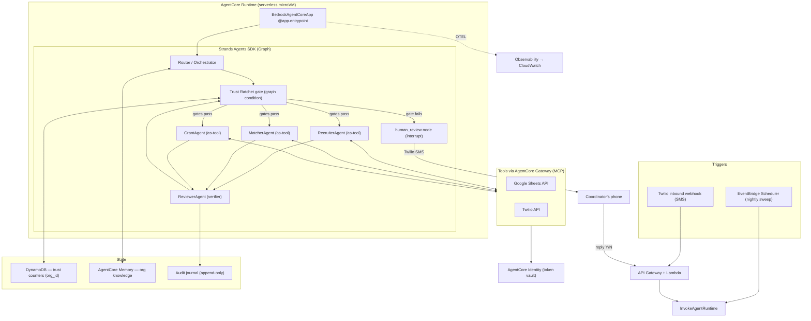

# Steward — a background AI agent for all-volunteer community orgs

> Built for the AWS **Agents for Humans** hackathon · Track: **Good Neighbor**.
> Steward runs quietly on the tools tiny orgs already use — a **Google Sheet + SMS** — handles the repetitive
> coordination work, and **surfaces to a human only when there's a real decision to make.**

## The idea in one paragraph
Tiny, budget-less, IT-less orgs (a 3-person food pantry, a PTA, a mutual-aid group) run on a group chat and a
spreadsheet. Steward lives *inside those exact tools* (zero migration, zero config) and autonomously matches
perishable/in-kind donations to local need, confirms volunteers via a 3-touch SMS sequence and auto-backfills
dropped shifts, tracks grant deadlines and drafts reports, and preserves institutional memory across volunteer
turnover — escalating to the coordinator only for genuine decisions.

## The unique mechanic — the **Trust Ratchet**
Steward **earns its autonomy per task-type.** It starts in *approve-everything* mode and graduates a task-type to
automatic **only after it proves reliability** (independently verified-correct actions); it **demotes** on error.
Anything touching **money or members' private data never goes fully automatic** (hard ceiling). The earned-trust
state is **institutional** — stored at the *organization* level — so it **survives coordinator turnover**. No existing
product does earned, graduated autonomy that persists across staff churn.

## Architecture



See `ARCHITECTURE.md` for the full narrative and `IMPLEMENTATION_PLAN.md` for complete specs.

## Tech stack
- **Strands Agents SDK** (mandatory) — Graph + Agents-as-Tools + interrupts.
- **Amazon Bedrock AgentCore** — Runtime, Gateway (Sheets/Twilio as MCP tools), Memory, Identity, Observability.
- **Amazon Bedrock** models — tiered (cheap Nova/Haiku for routing/verification, Claude Sonnet for hard steps).
- **DynamoDB** for the trust-ladder counters; **Twilio** SMS; **Google Sheets** as the org substrate.

## Repository layout
```
app/        agent code (entrypoint, graph, ratchet, agents, nodes, tools)
config/     ratchet.yaml — tune the Trust Ratchet
infra/      DynamoDB, EventBridge scheduler, inbound webhook, Gateway specs
scripts/    seed the demo Sheet, run the local demo
tests/      ratchet + graph tests
```

## Getting started
See **`SETUP.md`** for account setup (AWS Builder ID, credits, Twilio, Google, Bedrock model access), then:
```bash
python3 -m venv .venv && source .venv/bin/activate
pip install -r requirements.txt
cp .env.example .env      # fill in per SETUP.md
pytest -q
```
Build order is defined in **`PHASED_IMPLEMENTATION.md`** (Phase 0 → Phase 6).

## Project documents
- `IMPLEMENTATION_PLAN.md` — single source of truth (specs, data model, references).
- `PHASED_IMPLEMENTATION.md` — phase-by-phase execution sequence with exit gates.
- `agents-for-humans-idea-research.md` — the idea + competitive landscape.
- `SETUP.md` — Phase 0 account checklist.

## License
MIT — see `LICENSE`.
